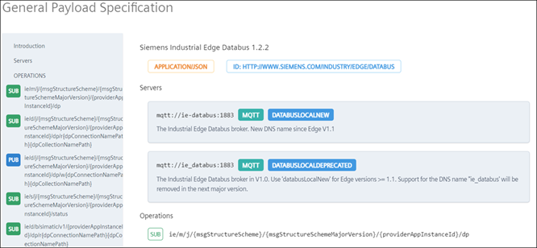
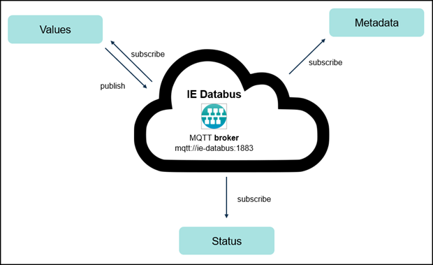
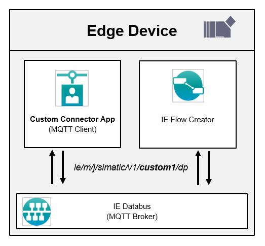

# Common Databus Payload Format

This tutorial explains the common databus payload format and shows an example how to create a custom connector out of it.

- [Common Databus Payload Format](#common-databus-payload-format)
  - [Description](#description)
    - [Overview](#overview)
    - [General Task](#general-task)
  - [Requirements](#requirements)
    - [Prerequisites](#prerequisites)
    - [Used components](#used-components)
  - [Format of Common Databus Payload](#format-of-common-databus-payload)
  - [Custom connector](#custom-connector)
  - [Usage](#usage)
  - [Documentation](#documentation)
  - [Contribution](#contribution)
  - [Licence and Legal Information](#licence-and-legal-information)

## Description

### Overview

The Industrial Edge Common Databus Payload Format defines how connectors should publish data to the IE Databus via MQTT. Connectors that fulfill this specification can then reuse the existing functionality of Industrial Edge apps in the Industrial Edge Ecosystem.

The official documentation can be found here under chapter "General Common Payload Format":

[Industrial Edge Common Databus Payload Format](https://industrial-edge.io/developer/systemapps/data-processing/databus/reference/index.html)

### General Task

The first section explains the **structure of the Common Databus Payload Format**. Here all possible operations and the dedicated topics are listed. Furthermore the responding messages are explained.

The second section shows an **example of a custom connector** using this format. Here we use a simple docker app "Custom Connector App", that acts as custom connector and provides some data. The data is published to the IE Databus via MQTT and can be then used by further apps. In this case we use the IE Flow Creator to read out the data and write some data back to the custom connector.

## Requirements

### Prerequisites

- Access to an Industrial Edge Management (IEM) with onboarded Industrial Edge Device (IED)
- IEM: Installed system configurator for Databus
- IED: Installed system app Databus
- IED: Installed app IE Flow Creator
- Linux VM with docker and docker-compose installed
- Installed Industrial Edge App Publisher
- Google Chrome (Version ≥ 72)

### Used components

- Industrial Edge Management (IEM) V1.4.0-42 / V1.6.3
- Industrial Edge Device (IED) V 1.7.0-18
- IE Databus Configurator V 1.6.21
- IE Databus V 1.6.6
- IE Flow Creator V1.3.8
- Industrial Edge App Publisher V1.5.6
- Docker Engine V20.10.10
- Docker Compose V1.29.2

## Format of Common Databus Payload

You can find a detailed description of the Common Databus Payload Format here:

1. [Databus broker](/docs/payload-format/PayloadFormat.md#databus-broker)
2. [Operations](/docs/payload-format/PayloadFormat.md#operations)
3. [Messages](/docs/payload-format/PayloadFormat.md#messages)

## Custom connector

To successfully run the example app "Custom Connector App", you need to follow these steps:

1. [Build and upload application](/docs/custom-connector/CustomConnector.md#build-and-upload-application)
2. [Configuration](/docs/custom-connector/CustomConnector.md#configuration)
3. [Deploy and run application](/docs/custom-connector/CustomConnector.md#deploy-and-run-application)

## Usage

xxx

## Documentation

You can find further documentation and help in the following links:

- [Industrial Edge Hub](https://iehub.eu1.edge.siemens.cloud/#/documentation)
- [Industrial Edge Forum](https://www.siemens.com/industrial-edge-forum)
- [Industrial Edge landing page](https://new.siemens.com/global/en/products/automation/topic-areas/industrial-edge/simatic-edge.html)
- [Industrial Edge GitHub page](https://github.com/industrial-edge)
- [Industrial Edge Common Databus Payload Format](https://industrial-edge.io/developer/systemapps/data-processing/databus/reference/index.html)

## Contribution

Thank you for your interest in contributing. Anybody is free to report bugs, unclear documentation, and other problems regarding this repository in the Issues section.
Additionally everybody is free to propose any changes to this repository using Pull Requests.

If you are interested in contributing via Pull Request, please check the [Contribution License Agreement](Siemens_CLA_1.1.pdf) and forward a signed copy to [industrialedge.industry@siemens.com](mailto:industrialedge.industry@siemens.com?subject=CLA%20Agreement%20Industrial-Edge).

## License and Legal Information

Please read the [Legal information](LICENSE.txt).
